# Fosc

[supercollider]: https://supercollider.github.io/
[lilypond]: http://lilypond.org/
[abjad]: http://abjad.mbrsi.org

__Fosc__ is a [SuperCollider][supercollider] API for generating musical notation in [LilyPond][lilypond].

__Fosc__ stands for FO-rmalised S-core C-ontrol (FO-r S-uperC-ollider). It's a close relative of [Abjad][abjad], and ports much of Abjad's Python code base to SuperCollider.

__Fosc__ lets you:


* Create musical notation in an object-oriented way
* Generate and transform complex rhythms through rhythm-makers and meter-rewriting
* Construct powerful component selectors and iterators for transforming musical objects in a score
* Control all of the typographic details of music notation
* Play musical scores through scsynth and MIDI


## <br>Installation

### 1. Install LilyPond

[LilyPond][lilypond] is an open-source program that engraves music notation in an automated way. __Fosc__ uses LilyPond to produce notational output. It's recommended that you install the most recent version of LilyPond directly from the LilyPond website. After you install LilyPond, check to see if LilyPond is callable from your command line.

    ~$ lilypond --version

    GNU LilyPond 2.19.83

    Copyright (c) 1996--2015 by
      Han-Wen Nienhuys <hanwen@xs4all.nl>
      Jan Nieuwenhuizen <janneke@gnu.org>
      and others.

    This program is free software.  It is covered by the GNU General Public
    License and you are welcome to change it and/or distribute copies of it
    under certain conditions.  Invoke as `lilypond --warranty` for more
    information.


### <br>2. Install Fosc

Download the __fosc__ master branch from this repository. Move the unzipped folder to your SuperCollider Extensions directory. Information on installing SuperCollider extensions can be found here: https://doc.sccode.org/Guides/UsingExtensions.html. 


### <br>3. Configure Fosc

In your sclang startup file, add code to allow __Fosc__ to communicate with LilyPond. __Note__: it's possible that your LilyPond binary may be installed somewhere different to the standard locations below.

__Mac OS X__
```supercollider
FoscConfiguration.lilypondExecutablePath = "/Applications/LilyPond.app/Contents/Resources/bin/lilypond";
```

__Linux__
```supercollider
FoscConfiguration.lilypondExecutablePath = "/usr/local/bin/lilypond";
```

<br>Once you've saved your changes, recompile the SuperCollider class library and test that __Fosc__ is able to call LilyPond.

```supercollider
FoscConfiguration.getLilypondVersionString;
```

```
2.19.82
```


## <br>Basic usage

### 1. Displaying music

<br>Display a note.
```supercollider
a = FoscNote(60, 1/4);
a.show;
```


<br>Display some notes in sequence.
```supercollider
a = FoscVoice([FoscNote('C4', 1/4), FoscNote('D4', 1/8)]);
a.show;
```
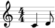

<br>View LilyPond output in the Post window.
```supercollider
a = FoscVoice([FoscNote('C4', 1/4), FoscNote('D4', 1/8)]);
a.format;
```

```
\new Voice {
    c'4
    d'8
}
```


<br>Display a score.
```supercollider
a = FoscVoice([FoscNote('C4', 1/4), FoscNote('D4', 1/8)]);
b = FoscVoice([FoscNote('Bb3', 1/8), FoscNote('Ab3', 1/4)]);
c = FoscScore([FoscStaff([a]), FoscStaff([b])]);
c.show;
```


### <br>2. Indicators

<br>Indicators attach to leaves.
```supercollider
a = FoscNote(60, 1/4);
a.attach(FoscArticulation('>'));
a.attach(FoscDynamic('f'));
a.show;
```
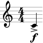


### <br>3. Spanners

<br>Spanners attach to two or more contiguous leaves.
```supercollider
a = FoscStaff(FoscLeafMaker().(#[60,62,64,65], [1/8]));
a.selectLeaves.slur;
a.selectLeaves.hairpin('p < f');
a.show;
```
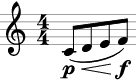


### <br>4. Tweaks, overrides, settings

<br>Tweak LilyPond Grob properties.
```supercollider
a = FoscNote(60, 1/4);
tweak(a.noteHead).style = 'harmonic';
a.show;
```
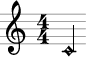

<br>Override LilyPond Grob properties.
```supercollider
a = FoscNote(60, 1/4);
override(a).noteHead.color = 'red';
a.show;
```


<br>Set LilyPond Context properties.
```supercollider
a = FoscScore([FoscStaff(FoscLeafMaker().(#[60,62,64,65], 1/8))]);
set(a[0]).instrumentName = FoscMarkup("Violin");
set(a).proportionalNotationDuration = FoscSchemeMoment(#[1,64]);
a.show;
```


### <br>5. Generate music with FoscLeafMaker

<br>Integer, String or Symbol elements in 'pitches' slot result in notes.
```supercollider
m = FoscLeafMaker().(pitches: #[60,64,"G4",'Bb4'], durations: [1/4]);
m.show;
```
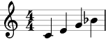

<br>Array elements in 'pitches' result in chords.
```supercollider
m = FoscLeafMaker().(pitches: #[[60,64,67],['Eb4','G4','Bb4']], durations: [1/2]);
m.show;
```
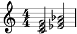

<br>Nil-valued elements in 'pitches' result in rests.
```supercollider
m = FoscLeafMaker().(pitches: nil, durations: 1/4 ! 4);
m.show;
```


<br>Values passed to 'pitches' can be mixed and matched.
```supercollider
m = FoscLeafMaker().(pitches: #[[60,64,67],nil,'Eb4','Bb4'], durations: [1/4]);
m.show;
```


<br>Pitches are repeated cyclically when the length of 'pitches' is less than the length of 'durations'.
```supercollider
m = FoscLeafMaker().(pitches: #[72,71], durations: [3/8,1/8,2/8,2/8]);
m.show;
```
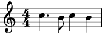

<br>Durations are repeated cyclically when the length of 'durations' is less than the length of 'pitches'.
```supercollider
m = FoscLeafMaker().(pitches: #[72,74,76,77], durations: [3/8,1/8]);
m.show;
```
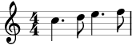

<br>Elements in 'durations' with non-power-of-two denominators result in tuplet-nested leaves.
```supercollider
m = FoscLeafMaker().(pitches: #[60,62,64,65], durations: [1/4, 1/12, 1/6, 1/2]);
m.show;
```


### <br>6. Generate rhythms with FoscRhythmMaker

<br>'Ratios' embed into 'divisions' as rhythmic proportions.
```supercollider
a = FoscRhythmMaker();
a.(divisions: [2/16,3/16,5/16], ratios: #[[3,1],[3,2],[4,3]]);
a.show;
```
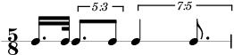

<br>Negative values in 'divisions' result in rests.
```supercollider
a = FoscRhythmMaker();
a.(divisions: [2/16,3/16,5/16], ratios: #[[-3,1],[3,2],[4,-3]]);
a.show;
```


<br>Add the output of a FoscRhythmMaker to a FoscStaff and rewrite pitches.
```supercollider
a = FoscRhythmMaker();
b = a.(divisions: [2/16,3/16,5/16], ratios: #[[-3,1],[3,2],[4,-3]]);
c = FoscStaff(b);
mutate(c).rewritePitches(#[60,62,64,65]);
c.show;
```
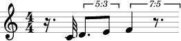

<br>Rhythm cells are repeated cyclically when the length of 'divisions' is less than the length of 'ratios'.
```supercollider
a = FoscRhythmMaker();
a.(divisions: [1/4], ratios: #[1,1,1,1,1] ! 4);
a.show;
```


<br>Rhythm cells are repeated cyclically when the length of 'ratios' is less than the length of 'divisions'.
```supercollider
a = FoscRhythmMaker();
a.(divisions: 1/4 ! 4, ratios: #[[1,1,1,1,1]]);
a.show;
```


<br>Apply a silence mask.
```supercollider
m = FoscSilenceMask(FoscPattern(indices: #[0,1,4,5,17,18,19]));
a = FoscRhythmMaker();
a.(divisions: 1/4 ! 4, ratios: #[[1,1,1,1,1]], masks: [m]);
a.show;
```
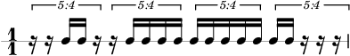

<br>Apply a sustain mask.
```supercollider
m = FoscSustainMask(FoscPattern(indices: #[0,1,4,5,17,18,19]));
a = FoscRhythmMaker();
a.(divisions: 1/4 ! 4, ratios: #[[1,1,1,1,1]], masks: [m]);
a.show;
```


<br>Apply a sustain mask and fuse leaves between successive onsets.
```supercollider
m = FoscSustainMask(FoscPattern(indices: #[0,1,4,5,17,18,19]), fuse: true);
a = FoscRhythmMaker();
a.(divisions: 1/4 ! 4, ratios: #[[1,1,1,1,1]], masks: [m]);
a.show;
```


<br>Apply a sustain mask, fuse leaves, and apply formatting rules with a FoscTupletSpecifier.
```supercollider
m = FoscSustainMask(FoscPattern(indices: #[0,1,4,5,17,18,19]), fuse: true);
t = FoscTupletSpecifier(extractTrivial: true, rewriteSustained: true, rewriteRestFilled: true);
a = FoscRhythmMaker(tupletSpecifier: t);
a.(divisions: 1/4 ! 4, ratios: #[[1,1,1,1,1]], masks: [m]);
a.show;
```


### <br>7. Selections

<br>Select all score components.
```supercollider
a = FoscStaff([FoscRest(1/4), FoscNote(60, 1/4), FoscNote(62, 1/4)]);
b = a.selectComponents;
b.do { |each| each.cs.postln };
```

```
FoscStaff([  ], 'Staff', false)
FoscRest(1/4)
FoscNote('C4', 1/4)
FoscNote('D4', 1/4)
```

<br>Select notes and rests only.
```supercollider
a = FoscStaff([FoscRest(1/4), FoscNote(60, 1/4), FoscNote(62, 1/4)]);
b = a.selectComponents(prototype: [FoscNote, FoscRest]);
b.do { |each| each.cs.postln };
```

```
FoscRest(1/4)
FoscNote('C4', 1/4)
FoscNote('D4', 1/4)
```

<br>Select pitched leaves only.
```supercollider
a = FoscStaff([FoscRest(1/4), FoscNote(60, 1/4), FoscChord(#[60,64,67], 1/4)]);
b = a.selectLeaves(pitched: true);
b.do { |each| each.cs.postln };
```

```
FoscNote('C4', 1/4)
FoscChord("C4 E4 G4", 1/4)
```


<br>Attach indicators to all selected pitched leaves.
```supercollider
a = FoscStaff(FoscLeafMaker().(#[nil,62,64,65,67,69,71,72], [1/8]));
b = a.selectLeaves(pitched: true);
b.do { |each| each.attach(FoscArticulation('>')) };
a.show;
```


### <br>8. Iteration

<br>Iterate over all score components.
```supercollider
a = FoscStaff(FoscLeafMaker().(#[60,62,64,65,67,69,71,72], [1/8]));
a.doComponents({ |each| each.cs.postln });
```

```
FoscStaff([  ], 'Staff', false)
FoscNote('C4', 1/8)
FoscNote('D4', 1/8)
FoscNote('E4', 1/8)
FoscNote('F4', 1/8)
FoscNote('G4', 1/8)
FoscNote('A4', 1/8)
FoscNote('B4', 1/8)
FoscNote('C5', 1/8)
```


<br>Iterate over notes, attach indicators.
```supercollider
a = FoscStaff(FoscLeafMaker().(#[nil,62,64,65,67,69,71,72], [1/8]));
a.doComponents({ |note| note.attach(FoscArticulation('>')) }, prototype: FoscNote);
a.show;
```


<br>Iterate over pitched logical ties.
```supercollider
a = FoscStaff(FoscLeafMaker().(#[60,60,62,nil,64,64], [1/4,1/24,1/12,1/8,1/4,1/4]));
m = a.selectLeaves;
tie(m[0..1]);
tie(m[4..]);
a.doLogicalTies({ |each| each[0].attach(FoscArticulation('>')) }, pitched: true);
a.show;
```


<br>Iterate over runs, attach slur to each run.
```supercollider
a = FoscStaff(FoscLeafMaker().(#[60,62,64,nil,65,nil,67,69], [1/8]));
a.doRuns { |run| if (run.size > 1) { run.slur } };
a.show;
```
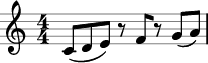


## <br>License
__Fosc__ is free software available under [Version 3.0 of the GNU General Public License](./LICENSE).

