# Fosc

[supercollider]: https://supercollider.github.io/
[lilypond]: http://lilypond.org/
[abjad]: https://abjad.github.io

__Fosc__ is a [SuperCollider][supercollider] API for generating musical notation in [LilyPond][lilypond].

__Fosc__ stands for FO-rmalised S-core C-ontrol (FO-r S-uperC-ollider). It's a close relative of [Abjad][abjad], and ports much of Abjad's Python code base to SuperCollider.

__Fosc__ lets you:


* Create musical notation in an object-oriented way
* Generate and transform complex rhythms through rhythm-makers and meter-rewriting
* Construct powerful component selectors and iterators for transforming musical objects in a score
* Control all of the typographic details of music notation
* Play musical scores through scsynth and MIDI


## <br>Installation

### Install LilyPond

[LilyPond][lilypond] is an open-source program that engraves music notation in an automated way. __Fosc__ uses LilyPond to produce notational output. It's recommended that you install the most recent version of LilyPond directly from the LilyPond website. After you install LilyPond, check to see if LilyPond is callable from your command line.

    ~$ lilypond --version

    GNU LilyPond 2.19.83

    Copyright (c) 1996--2015 by
      Han-Wen Nienhuys <hanwen@xs4all.nl>
      Jan Nieuwenhuizen <janneke@gnu.org>
      and others.

    This program is free software.  It is covered by the GNU General Public
    License and you are welcome to change it and/or distribute copies of it
    under certain conditions.  Invoke as `lilypond --warranty` for more
    information.


### <br>Install Fosc

Download the __fosc__ master branch and unzip. Rename the 'fosc-master' folder to 'fosc'. Move the 'fosc' folder to your SuperCollider Extensions directory. Information on installing SuperCollider extensions can be found here: https://doc.sccode.org/Guides/UsingExtensions.html. 


### <br>Configure Fosc

In your sclang startup file, add code to allow __Fosc__ to communicate with LilyPond. __Note__: it's possible that your LilyPond binary may be installed somewhere different to the standard locations below.

__Mac OS X__
```supercollider
FoscConfiguration.lilypondExecutablePath = "/Applications/LilyPond.app/Contents/Resources/bin/lilypond";
```

__Linux__
```supercollider
FoscConfiguration.lilypondExecutablePath = "/usr/local/bin/lilypond";
```

<br>Once you've saved your changes, recompile the SuperCollider class library and test that __Fosc__ is able to call LilyPond.

```supercollider
FoscConfiguration.lilypondVersionString;
```
```
2.19.82
```


## <br>Creating score objects

<br>Display a note.
```supercollider
a = FoscNote(60, 1/4);
a.show;
```
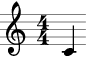


<br>Display some notes in sequence.
```supercollider
a = FoscVoice([FoscNote(60, 1/4), FoscNote(62, 1/8)]);
a.show;
```
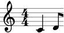

<br>View LilyPond output in the Post window.
```supercollider
a = FoscVoice([FoscNote(60, 1/4), FoscNote(62, 1/8)]);
a.format;
```
```
\new Voice {
    c'4
    d'8
}
```

<br>Display a score.
```supercollider
a = FoscVoice([FoscNote("c'", 1/4), FoscNote("d'", 1/8)]);
b = FoscVoice([FoscNote("bf", 1/8), FoscNote("af", 1/4)]);
c = FoscScore([FoscStaff([a]), FoscStaff([b])]);
c.show;
```
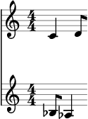


## <br>Augmenting and tweaking score objects

<br>Indicators attach to leaves.
```supercollider
a = FoscNote(60, 1/4);
a.attach(FoscArticulation('>'));
a.attach(FoscDynamic('f'));
a.show;
```
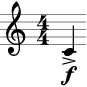

<br>Spanners attach to two or more contiguous leaves.
```supercollider
a = FoscStaff(#[60,62,64,65].collect { |pitch| FoscNote(pitch, 1/8) });
a.selectLeaves.slur;
a.selectLeaves.hairpin('p < f');
a.show;
```
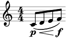

<br>Override LilyPond Grob properties.
```supercollider
a = FoscNote(60, 1/4);
override(a).noteHead.style = 'harmonic';
a.show;
```
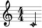

<br>Set LilyPond Context properties.
```supercollider
a = FoscScore([FoscStaff(#[60,62,64,65].collect { |pitch| FoscNote(pitch, 1/8) })]);
set(a[0]).instrumentName = FoscMarkup("Violin");
set(a).proportionalNotationDuration = FoscSchemeMoment(#[1,64]);
a.show;
```


## <br>Creating music with FoscMusicMaker

<br>Make music from 'durations' and 'pitches'.
```supercollider
a = FoscMusicMaker();
b = a.(durations: 1/4 ! 4, pitches: #[60,62,64,65]);
b.show;
```
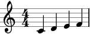

<br>Use a string of LilyPond note names.
```supercollider
a = FoscMusicMaker();
b = a.(durations: 1/4 ! 4, pitches: "c' d' ef' f'");
b.show;
```


<br>'pitches' are repeated cyclically when the length of 'pitches' is less than the length of 'durations'.
```supercollider
a = FoscMusicMaker();
b = a.(durations: [3/8,1/8,2/8,2/8], pitches: #[60,62]);
b.show;
```
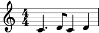

<br>'divisions' embed into 'durations' as rhythmic proportions.
```supercollider
a = FoscMusicMaker();
b = a.(durations: [2/16,3/16,5/16], divisions: #[[3,1],[3,2],[4,3]], pitches: #[60,62]);
b.show;
```
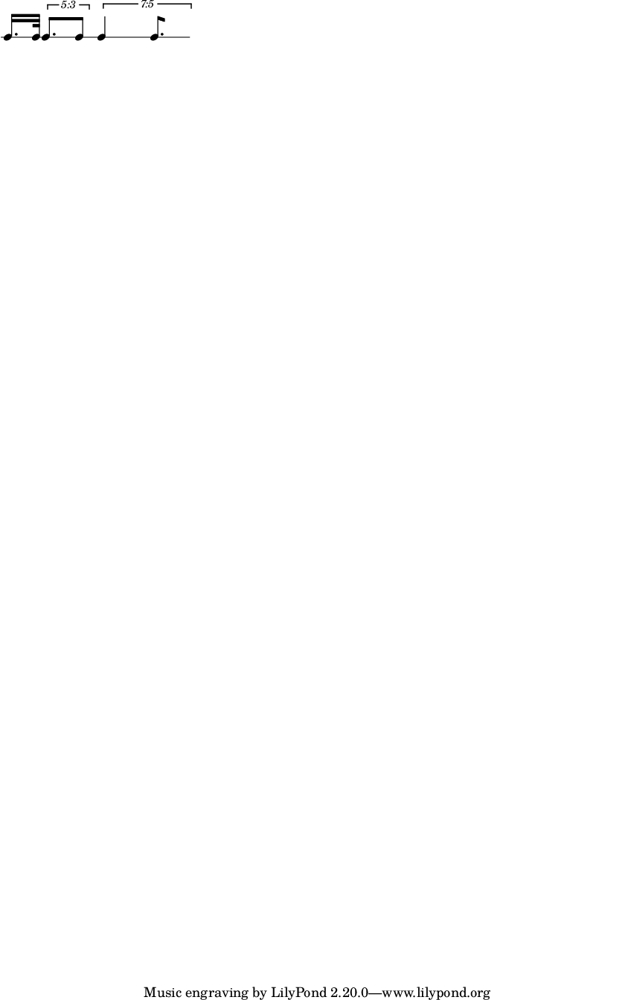

<br>Negative 'divisions' are rests.
```supercollider
a = FoscMusicMaker();
b = a.(durations: [2/16,3/16,5/16], divisions: #[[-3,1],[3,2],[4,-3]], pitches: #[60,62]);
b.show;
```
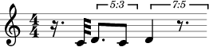

<br>Rhythm cells are repeated cyclically when the length of 'durations' is less than the length of 'divisions'.
```supercollider
a = FoscMusicMaker();
b = a.(durations: [1/4], divisions: #[1,1,1,1,1] ! 4, pitches: #[60,62]);
b.show;
```
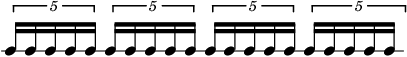

<br>Rhythm cells are repeated cyclically when the length of 'divisions' is less than the length of 'durations'.
```supercollider
a = FoscMusicMaker();
b = a.(durations: 1/4 ! 4, divisions: #[1,1,1,1,1], pitches: #[60,62]);
b.show;
```


<br>Apply a 'mask' to fuse contiguous musical events. Mask patterns repeat cyclically.
```supercollider
a = FoscMusicMaker();
b = a.(durations: 1/4 ! 4, divisions: #[1,1,1,1,1], mask: #[2,1], pitches: #[60,62]);
b.show;
```
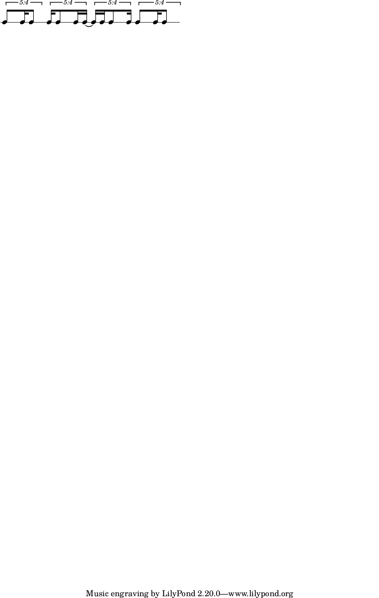

<br>Negative 'mask' values are interpreted as rests.
```supercollider
a = FoscMusicMaker();
b = a.(durations: 1/4 ! 4, divisions: #[1,1,1,1,1], mask: #[2,-1], pitches: #[60,62]);
b.show;
```
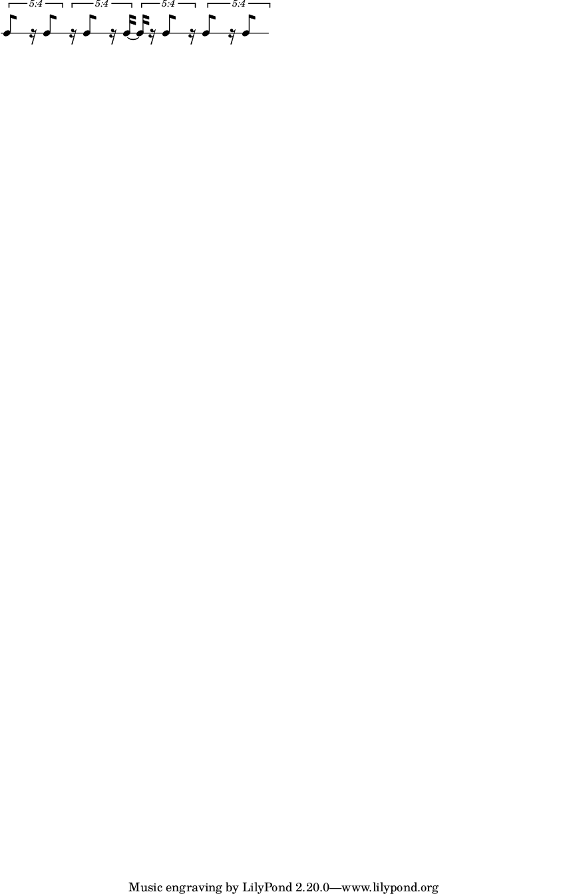


## <br>Selections

<br>Select all score components.
```supercollider
a = FoscStaff([FoscRest(1/4), FoscNote(60, 1/4), FoscNote(62, 1/4)]);
b = a.selectComponents;
b.do { |each| each.cs.postln };
```
```
FoscStaff([  ], Staff, false, nil)
FoscRest(1/4)
FoscNote("c'", 1/4)
FoscNote("d'", 1/4)
```

<br>Select notes and rests.
```supercollider
a = FoscStaff([FoscRest(1/4), FoscNote(60, 1/4), FoscNote(62, 1/4)]);
b = a.selectComponents(prototype: [FoscNote, FoscRest]);
b.do { |each| each.cs.postln };
```
```
FoscRest(1/4)
FoscNote("c'", 1/4)
FoscNote("d'", 1/4)
```

<br>Select pitched leaves.
```supercollider
a = FoscStaff([FoscRest(1/4), FoscNote(60, 1/4), FoscChord(#[60,64,67], 1/4)]);
b = a.selectLeaves(pitched: true);
b.do { |each| each.cs.postln };
```
```
FoscNote("c'", 1/4)
FoscChord("c' e' g'", 1/4)
```


<br>Attach indicators to all leaves in a selection.
```supercollider
a = FoscStaff(FoscMusicMaker().(durations: 1/8 ! 8, pitches: (60..67)));
b = a.selectLeaves(pitched: true);
b.do { |each| each.attach(FoscArticulation('>')) };
a.show;
```
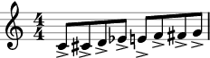


## <br>Iteration

<br>Iterate over all score components.
```supercollider
a = FoscStaff(FoscMusicMaker().(durations: 1/8 ! 8, pitches: (60..67)));
a.doComponents({ |each| each.cs.postln });
```
```
FoscStaff([  ], Staff, false, nil)
FoscNote("c'", 1/8)
FoscNote("cs'", 1/8)
FoscNote("d'", 1/8)
FoscNote("ef'", 1/8)
FoscNote("e'", 1/8)
FoscNote("f'", 1/8)
FoscNote("fs'", 1/8)
FoscNote("g'", 1/8)
```


<br>Iterate over notes, attach indicators.
```supercollider
a = FoscStaff(FoscMusicMaker().(durations: 1/8 ! 4, mask: #[-1,1,1,1], pitches: #[60,61,62]));
a.doComponents({ |note| note.attach(FoscArticulation('>')) }, prototype: FoscNote);
a.show;
```
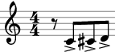


<br>Iterate over runs, attach slurs.
```supercollider
a = FoscMusicMaker();
b = a.(durations: 1/8 ! 8, mask: #[-1,1,1,1,-1,1,1,1], pitches: (60..65));
c = FoscStaff(b);
c.doRuns { |run| if (run.size > 1) { run.slur } };
c.show;
```
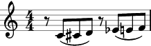


## <br>License
__Fosc__ is free software available under [Version 3.0 of the GNU General Public License](./LICENSE).

